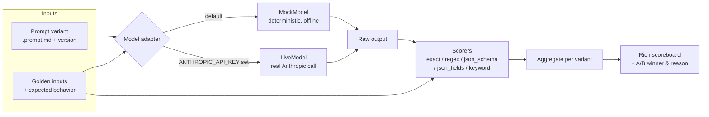

# prompt-library

A curated, **versioned** library of production-minded system prompts — plus a
tiny **offline eval harness** that regression-tests them. Prompts are treated as
code: they have versions, a "why it works" rationale, golden inputs, and scorers
that catch drift.

## The problem

Prompts rot. You tweak a system prompt to fix one edge case, ship it, and three
other behaviours quietly regress — because nobody re-checks the old cases. Most
teams have **zero regression testing for prompts**. A prompt change is a
production change with no CI, no diff you can score, and no record of *why* the
last wording was chosen.

This repo is a small, honest answer to that:

1. **A prompt library** where each prompt is a file with YAML frontmatter
   (`name`, `version`, `intent`, `model_notes`, `inputs`) and a **Why it works**
   section explaining the technique (role priming, null policies, refusal
   handling, bounded chain-of-thought, position-bias control, …).
2. **An eval harness** that runs each prompt variant against golden inputs,
   scores the output (exact-match / regex / JSON-schema-valid / field-accuracy /
   keyword), and prints a scoreboard — including an **A/B comparison** that
   declares a winner and says why.
3. **A prompt improver** (`python cli.py improve`) that takes a raw / weak prompt
   — or a block of free text pasted from an inbox or notes — diagnoses it against
   the same prompt-engineering rubric the library teaches, rewrites it into a
   structured prompt, and explains every change.
4. Everything runs **offline against a deterministic mock / rule-based path**, so
   `pytest` and the demos work in CI with no API key.

## How the eval flow works



The flow: **prompt variant → golden inputs → model → scorers → scoreboard**.
For A/B, the *same* golden inputs run against ≥2 variants and the harness reports
which won and by how much.

## Quickstart

```bash
git clone <this repo> && cd prompt-library
python -m venv .venv && source .venv/bin/activate
pip install -r requirements.txt

# Run the full eval suite (mock model, no key needed)
python -m evals.run

# Run one suite, CI-friendly plain output
python -m evals.run contact-extraction --no-table

# Run the tests
pytest -q

# Regenerate the prompt catalog
python cli.py index

# Diagnose and rewrite a weak prompt (offline, rule-based)
python cli.py improve "pull out the contact details from this email"
```

By default everything uses the **MockModel** — deterministic, offline, no key.
A banner makes the active backend obvious. If you set `ANTHROPIC_API_KEY` and
install `anthropic`, the harness switches to the live path automatically (and the
banner turns red).

## Example scoreboard output

```text
╭──────────────────────── prompt-library evals ────────────────────────╮
│ MOCK MODEL — deterministic, offline, no API key used                  │
╰───────────────────────────────────────────────────────────────────────╯
            Eval suite: contact-extraction
┏━━━━━━━━━━━━━━━━━━━━━━━━━━━━━━━━┳━━━━━━━┳━━━━━━━━━━━━┓
┃ Variant                        ┃ Cases ┃ Mean score ┃
┡━━━━━━━━━━━━━━━━━━━━━━━━━━━━━━━━╇━━━━━━━╇━━━━━━━━━━━━┩
│ contact-extraction-v2-hardened │     3 │      1.000 │
│ contact-extraction-v1-baseline │     3 │      0.417 │
└────────────────────────────────┴───────┴────────────┘
╭───────────────────────────── A/B result ─────────────────────────────╮
│ Winner: contact-extraction-v2-hardened  (+0.583 mean vs baseline)     │
│ Why: the hardened variant emits strict JSON-only output, so it passes │
│ the schema scorer cleanly where the baseline loses points for         │
│ markdown-fenced / non-JSON-only output and dropped null keys.         │
╰───────────────────────────────────────────────────────────────────────╯
```

The A/B case is deliberate: `contact-extraction-v1-baseline` is a thin,
under-specified prompt; `contact-extraction-v2-hardened` adds a null policy, a
"JSON only" guard, and a worked example. The harness shows, with numbers, that
those prompt-engineering changes — and nothing else — produce the win.

## Prompt improver

The eval harness *scores* prompts; the improver helps you *write a better one*.
Give it a raw, weak prompt (or a block of free text from an inbox / notes) and it:

1. **Diagnoses** it against a rubric — explicit role, sufficient context, clear
   task, output format/schema, constraints, examples, success criteria, and a
   safety/refusal policy — marking each criterion `present` / `weak` / `missing`
   with a note, plus an overall *readiness* score.
2. **Rewrites** it into a structured prompt (Role / Context / Task / Output
   format / Constraints / Success criteria / If you are unsure), injecting
   checklist-driven scaffolding for whatever was missing while preserving your
   actual instruction.
3. **Explains** each change, tied back to the prompt-engineering principle (and
   the library category) it comes from.

The default rewriter is **deterministic and rule-based** — fully offline, no key,
so it behaves reproducibly. If `ANTHROPIC_API_KEY` and `anthropic` are present it
switches to an LLM rewrite via the catalogued
[`prompt-improver`](prompts/rewriting/prompt-improver.prompt.md) meta-prompt; a
banner makes the active backend obvious (mirroring the eval harness).

```bash
# Diagnose + rewrite a weak one-liner (rich output)
python cli.py improve "pull out the contact details from this email"

# Read the raw prompt from a file (e.g. something pasted from an inbox)
python cli.py improve --file improver/examples/inbox-paste.txt

# Print only the rewritten prompt (pipe it straight into a new .prompt.md)
python cli.py improve "summarize this" --plain
```

**Before**

```text
pull out the contact details from this email
```

**After** (rule-based rewrite, abbreviated)

```markdown
# System prompt

## Role
You are a careful, domain-aware assistant. Adopt the expertise the task
implies and hold a high bar for accuracy.

## Task
pull out the contact details from this email

## Output format
Respond in a single, clearly structured block. If the task implies discrete
fields, return a JSON object with one key per field and no surrounding prose
or markdown fences.

## If you are unsure
If the input is missing required information, is ambiguous, or asks for
something you should not do, say so explicitly instead of guessing. Use null
(or 'unknown') for fields you cannot determine from the input.
```

(The full output also fills in Context, Constraints, and Success criteria, and
prints a diagnosis table plus a "what changed & why" rationale.)

## Repository layout

```text
prompt-library/
├── prompts/                 # the library (15 prompts, 7 categories)
│   ├── role-prompts/
│   ├── structured-output/
│   ├── agent-and-chain/
│   ├── extraction/          # contains the v1/v2 A/B pair
│   ├── classification/
│   ├── rewriting/           # incl. the prompt-improver meta-prompt
│   ├── eval-rubrics/        # LLM-as-judge rubrics
│   └── INDEX.md             # generated catalog (name/category/version/intent)
├── schemas/                 # JSON Schemas + matching pydantic models
├── evals/
│   ├── promptio.py          # parse .prompt.md frontmatter + body
│   ├── model.py             # MockModel (default) + optional LiveModel
│   ├── scorers.py           # exact / regex / json_schema / json_fields / keyword
│   ├── run.py               # runner + rich scoreboard + A/B winner
│   └── golden/              # golden inputs + expected behavior (YAML)
├── improver/                # the prompt improver (diagnose -> rewrite -> explain)
│   ├── rubric.py            # the diagnostic criteria (declarative)
│   ├── diagnose.py          # rule-based per-criterion detectors
│   ├── rewrite.py           # deterministic rewriter + optional LLM path
│   ├── improve.py           # orchestration; reuses evals.model backend selection
│   ├── render.py            # rich diagnosis table + rewrite + rationale panels
│   ├── cli.py               # the `improve` subcommand
│   └── examples/            # weak prompts to try it on
├── tests/                   # pytest: scorers, harness, A/B logic, prompt + improver
├── cli.py                   # `index` / `list` / `evals` / `improve`
├── requirements.txt
├── IMPLEMENTATION_PLAN.md
└── LICENSE
```

## How to add a new prompt

1. Create `prompts/<category>/<name>.prompt.md` with frontmatter:

   ```yaml
   ---
   name: my-prompt
   version: 1.0.0
   category: extraction
   intent: >
     One or two lines on what this prompt is for.
   model_notes: >
     Any model-specific caveats.
   inputs:
     - text: what the input is
   ---
   ```

2. Write the prompt body, then a `## Why it works` section. (The test suite
   asserts every prompt has both valid frontmatter and that section.)
3. Run `python cli.py index` to refresh `prompts/INDEX.md`.

## How to add / run an eval

1. Add a golden suite under `evals/golden/<task>.yaml`:

   ```yaml
   task: my-task
   variants:
     - name: my-prompt
       prompt: prompts/extraction/my-prompt.prompt.md
   cases:
     - id: case-1
       input: { text: "..." }
       checks:
         - scorer: json_schema
           schema: my.schema.json
         - scorer: json_fields
           expected: { field: value }
   ```

2. For an **A/B test**, list two or more `variants`. The harness runs the same
   `cases` against each and reports the winner.
3. If you use the live model, register a deterministic mock responder for new
   prompt names in `evals/model.py` so offline tests keep working. (Scorers are
   model-agnostic; only the mock responders are prompt-specific.)
4. Run `python -m evals.run my-task`.

### Scorers available

| Scorer        | Passes when…                                                        |
| ------------- | ------------------------------------------------------------------- |
| `exact_match` | output (trimmed) equals `expected`                                  |
| `regex`       | the `expected` pattern matches the output                           |
| `json_schema` | output is JSON-only and valid against the schema (half credit if it parsed only after unwrapping a fence) |
| `json_fields` | output is a JSON object; partial credit per correct field           |
| `keyword`     | required keywords all appear (case-insensitive); partial credit     |

## About

Personal project, built with Claude Code (AI-assisted). It is a portfolio piece
demonstrating how I think about prompt engineering and prompt evaluation — prompts
as versioned artifacts with a rationale and a regression suite, not as throwaway
strings. The prompts and examples are generic and synthetic; nothing here is tied
to any employer or proprietary system. Use, fork, and adapt freely under the MIT
license.
